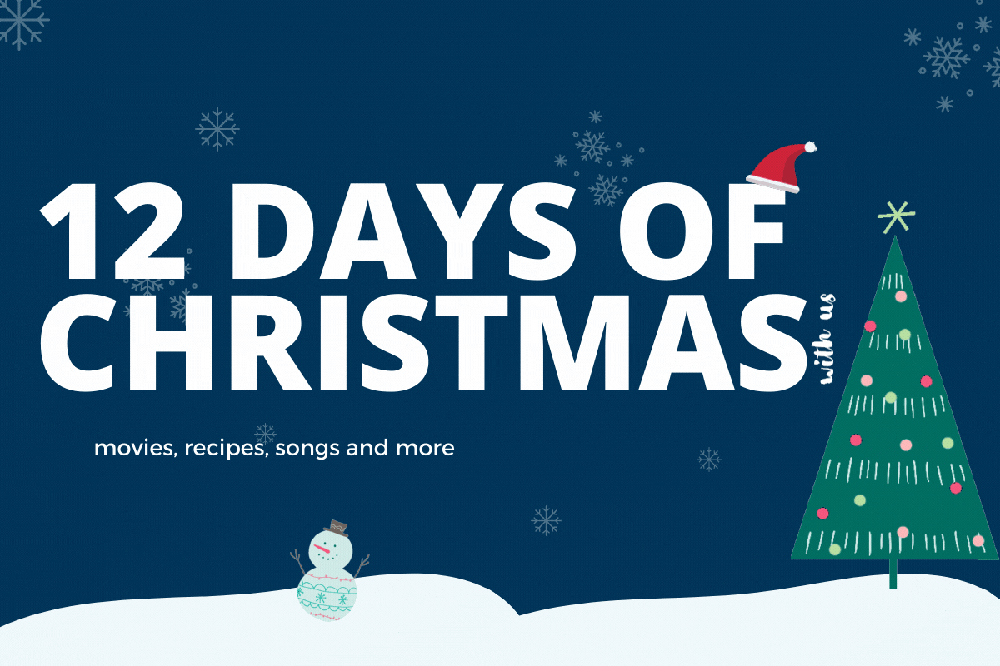

# 12-days-of-christmas-with-us
*This website helps plan your Christmas with movie, recipe and song recommendations!*

## **LINKS**

[](https://www.youtube.com/watch?v=fqxJXhvJ6S4)
* [Alternative Demo Link (Heroku)](https://twelve-day-of-christmas.herokuapp.com/)
* [Devpost Project](https://devpost.com/software/12-days-of-christmas-with-us)

## **Inspiration**
🎵 On the first day of Christmas... My true love sent to me... A link to an awesome website called **12-days-of-christmas-with-us** that gets everyone into the Christmas Spirit in just 12 Days 🎵

## **What It Does**
* Let's you plan your Christmas days
* **Movies**: A Christmas movie a day brings Santa your way
* **Recipes**: Keep your tummy in the festivity with our recommended recipes for each day
* **Songs**: Play our recommended Christmas songs right from our website* **Customize**: After signing up and logging in, you can customize your movie, recipe and song preferences for each day according to your liking
* **Notes**: there's even a virtual notepad to capture your Christmas-y thoughts or keep track of your Christmas Todo List (making sure you don't forget to buy that gift for Uncle Tim!)

## **How It Was Built**
* ``` Flask ```
* ``` HTML and CSS ```
* ``` SQLite ```
* ``` Heroku ```
* ``` Git ```
## **How To Run It**
1. Install Flask : [LINK](https://flask.palletsprojects.com/en/2.0.x/quickstart/)
2. Configure Flask environment variable: ``` FLASK_APP=christmas ```
3. Run flask: ``` flask run ```

## **What's Next?**
* Add more ways to sign up/log in (Google, GitHub, etc.)
* Send confirmation emails for signing up
* Scrape movie/recipe information from the web to display onto the website
* Populate the database with more data
